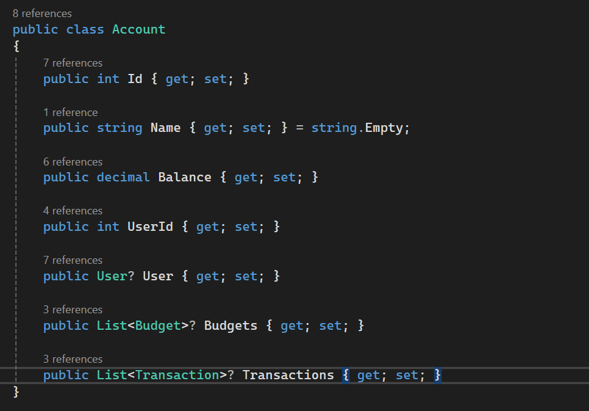
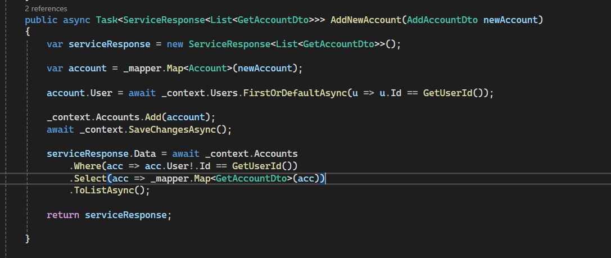
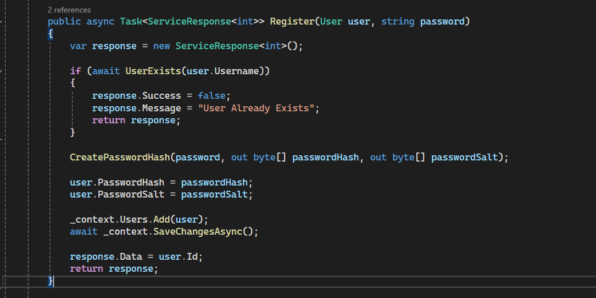

# Back End Module Project

## Situation

For the backend module, I created a <strong>Personal Finance Management App</strong>. The purpose of this app was to allow users to:

<ul>
    <li>Sign up and create an account.</li>
    <li>Open an account and perform transactions like deposits and withdrawals.</li>
    <li>Generate a report to view account information and all related transactions in an easy-to-read format.</li>
</ul>

## Task

As this was a backend-only project, my tasks included:

<ul>
    <li><strong>Creating models</strong>: Developed multiple models to represent entities such as accounts, transactions, and users.</li>
    <li><strong>Implementing CRUD operations</strong>: Developed methods to create, read, update, and delete records for each model.</li>
    <li><strong>Building API endpoints</strong>: Created API endpoints to interact with the database and call these methods, enabling users to:
        <ul>
            <li>Perform various actions on their accounts.</li>
            <li>View personalized account and transaction details.</li>
        </ul>
    </li>
</ul>

## Action

This app was a solo project, so I had to set up everything myself, including making the connection to the database, creating the models, setting up the associations to other models, and creating the API routes.

<strong>Account model</strong> -- which has associations to User, Budget, and Transaction

<strong>Service Method</strong> -- for creating a new account, which will then be called by the API to create the account in the database

<strong>Method</strong> -- that creates a user and hashes and salts the password for protection

