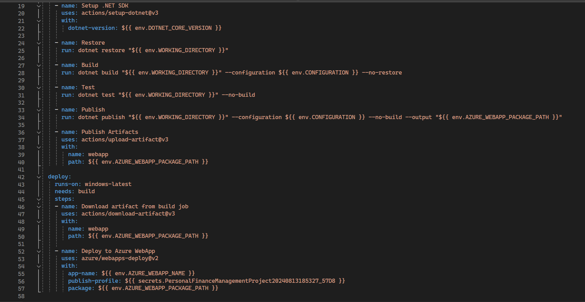

# Deployment Module Project

## Situation

For the deployment module, I decided to build on top of my backend module project where I created a <strong>Personal Finance Management App</strong>. by making slight improvements allowing the application to be successfully deployed.

<ul>
    <li>Switched over from a local database to a Azure hosted SQL Database.</li> 
    <li>Used GitHub actions and created a file that would be ran everytime changes were pushed to the repository.</li>
    <li>Deployed the application to Azure.</li>
</ul>

## Task

This project was created for the front end module using mendix but also has a backend allowing it to communicate with the database to help store the neccessary data. My tasks for this project included:

The main part to this project was the deployment part as the backend was already from a previous project, the tasks for this project included:

<ul>
    <li><strong>Migrating to Azure SQL Database</strong>: Transitioned from a local database to a Azure SQL Database which is cloud hosted </li>
    <li><strong>Continuous Integration and Continuous Deployment (CI/CD)</strong>: Used Github actions and a custom workflow file that will do things like install dependencies, build the project, and Ensure there are no errors when building and whenever changes were pushed to the repository</li>
    <li><strong>Deploy the application</strong>: The application was deployed to Azure, with GitHub Actions configured to automate the redeployment process. Whenever changes were made and pushed to the repository, the pipeline would run, and if there were no errors encountered, the application would be redeployed with the latest updates.
    </li>
</ul>

## Action

This was a solo project, so I had to setup the Azure SQL Database and making sure that the connection was working correctly, Setting up GitHub Actions and creating the Workflow File, and Deploying the application to Azure.

 --<strong>GitHub Workflow File</strong> Snippet of the workflow file showing the different jobs that are being ran whenever theres changes that are pushed to the repository 

## Result

<a href = "https://github.com/andrewozo/PersonalFinanceManagementProject">Deployment/Backend Project Repository Link</a>

## Job Competencies

<strong>JF 4.3 Is able to build, manage and deploy code into the relevant environment</strong> 
This application was successfully deployed to Azure while using GitHub actions to ensure that whenever new changes are pushed to the repository, the project can build with no errors and redeploy the application to reflect the recent changes.

<strong>JF 3.3 Can link code to data sets</strong> 
This project is connected to a Azure SQL Database, and using the EntityFramework Library from .NET, I was able to create tables corresponding to the Models I Created like Account and Transaction.

