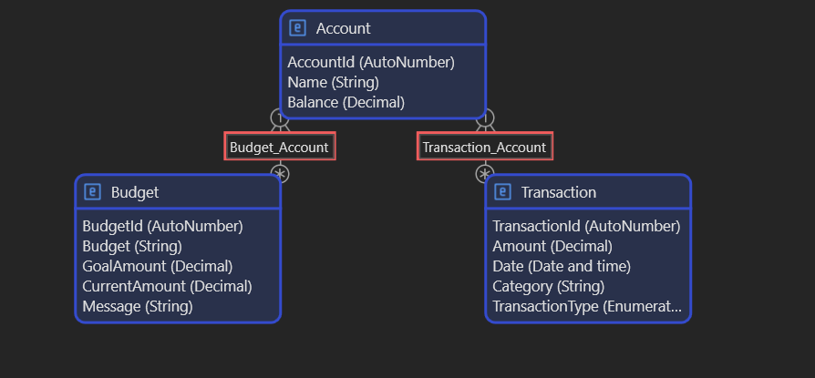

# Front End Module Project

## Situation

For the front end module, I created a <strong>Financial Tracker App</strong>. Using a new to me Technology called Mendix which is a low code application development platform. The purpose of this app was to allow users to:

<ul>
    <li>Sign up and create an user profile.</li>
    <li>Open an account and add transactions like Purchases,Withdrawals,Deposits, and adding to any budgets they have created</li>
    <li>Be able to easily view any important information about their account in the account dashboard, while being able to also see more specific information about things like their transactions and budgets.</li>
</ul>

## Task

This project was created for the front end module using mendix but also has a backend allowing it to communicate with the database to help store the neccessary data. My tasks for this project included:

<ul>
    <li><strong>Creating Entities</strong>: Created multiple entities such as Account, Transaction, User, and Budget. that were representations of the tables and their attributes in the database </li>
    <li><strong>Creating pages</strong>: Since this was a front end project, pages were designed to display relevant data to users, the main page serves as a dashboard, showing the most recent account related data and providing navigation to specific pages, Such as Transaction and Budget, where users can view more detailed information.</li>
    <li><strong>Creating Microflows</strong>: Microflows in Mendix are processes that you design, that allow you to be able to do things like:
        <ul>
            <li>Take the input from a new Transaction form and create a new Transaction instance in the database.</li>
            <li>Retrieve user specific information and displaying it on a designated page</li>
            <li>applying rules and conditional logic to make sure that the data is accurate and inputted correclty </li>
        </ul>
    </li>
</ul>

## Action

This app was a solo project, so I had to set up everything myself, including creating the entities, creating and designing the pages, creating the microflows.

 --<strong>Domain Model</strong> Visual Representation of the tables in the database

 --<strong>Micrflow</strong> this is an example of a microflow that I developed for when creating a new transaction. It checks to see what kind of transaction it is first then validates the data before saving it to the database.

## Result

<a href = "https://github.com/andrewozo/Financial-Tracker-Mendix">Repo Link</a>

## Job Competencies

<strong>JF 2.3 Can develop effective user interfaces</strong> 
For this project I developed and designed all the pages needed to be able to display data and also pages that were forms intaking the data.

<strong>JF 2.5 Can implement a responsive User Interface</strong> 
I also implemented the functionality for these pages that allow the user to be able to see the data specific to them and to be able to create new transactions through the new transaction form and see their information get updated in real time.

<strong>JF 6.4 Works independently and takes responsibility. For example, has a disciplined and responsible approach to risk and stays motivated and committed when facing challenges</strong> 
This was a solo project using a technology that was new to me. Throughout the project, I encountered various challenges, such as properly displaying and integrating data. Given that I will be using this technology in my daily work, I focused on overcoming these challenges to enhance my skills and ensure continuous improvement.

